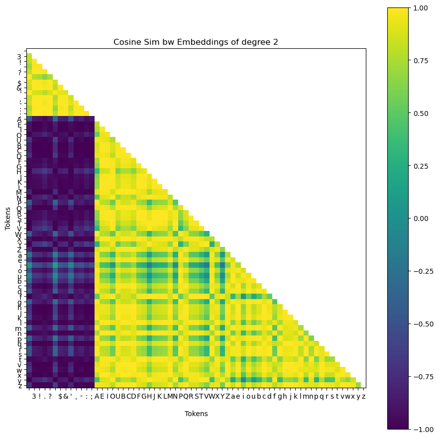
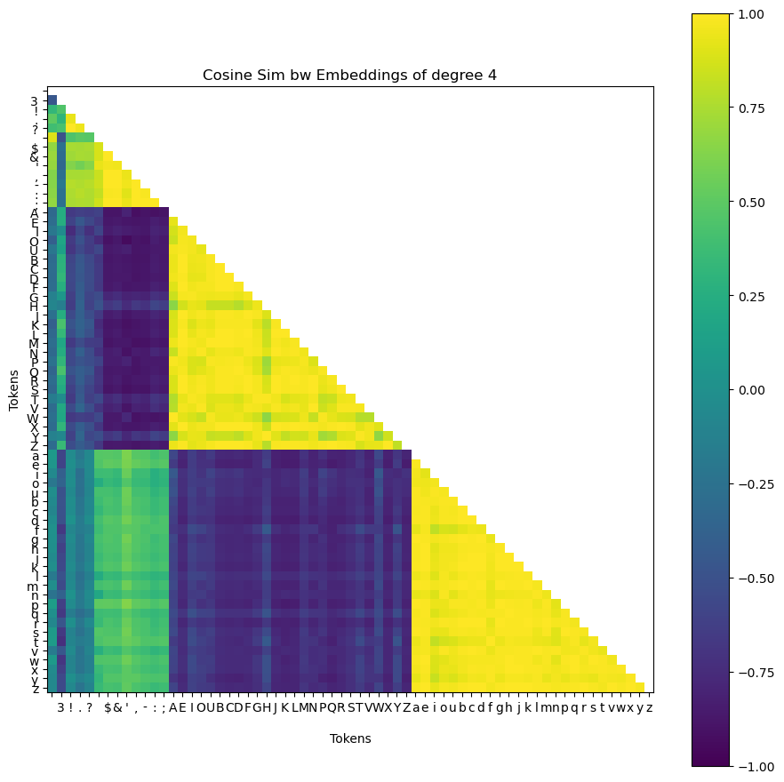
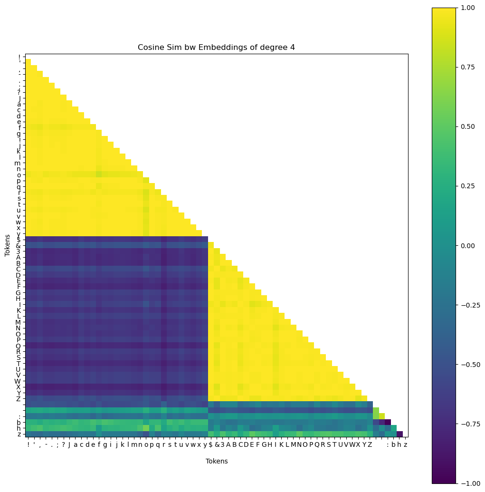
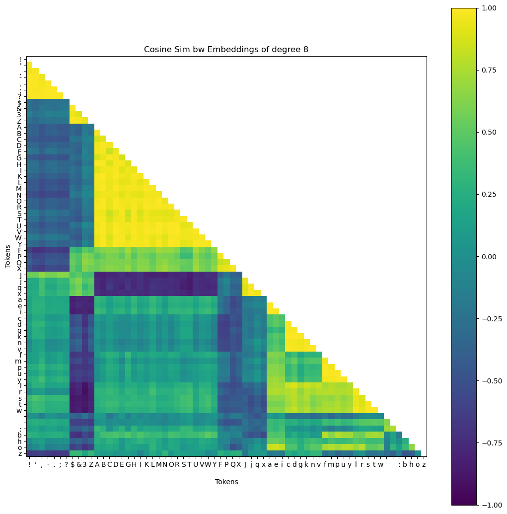

# Hierarchical Embeddings
the idea here stems off from [matryoshka embeddings](https://arxiv.org/abs/2205.13147) which are a hierarchical representation scheme designed for representation learning that allowed one representation model to train embedding vectors of varying sizes simultaneously that also fit inside each other, like russian nesting dolls. You can find a simple to understand implementation of matryoshka embeddings on my other github repo [here](https://github.com/evintunador/matryoshkaGPT) as well as my video explanation [here](https://youtu.be/dUeM_yDuGbg)

In this repo, hierarchical embeddings are embedding vectors where subsets correspond to "groups" of tokens. these groups can either be imposed on the models as human-defined categories which you'll see in `imposed_hierarchical_embeddings_GPT.ipynb` or they can be derived from the data as in `emergent_hierarchical_embeddings_GPT.ipynb`. Here's my youtube video walkthrough of the concepts

in `imposed_hierarchical_embeddings_GPT.ipynb` I'm trying to force a pre-determined hierarchial structure onto the embeddings. The idea here is that hopefully I can force a model to think in terms of human-defined hierarchical conceptual categories. If those are good categories and I'm very lucky, then the model may even be able to train faster.
       - so far I've got it all up & running with a model trained and some example images. It does in fact seem like i can force structure on the embeddings at least to some degree. most of the work to be done now has to do with hyperparameter tuning and trying it on a slightly larger model. Here's an image example, where "degree" means the length of the embedding subset

1b. in `emergent_hierarchical_embeddings_GPT.ipynb` I've gotten the model to dynamically present to us hierarchies of tokens that it learns through training. for example, if we're doing character-wise tokenization, then i want the smaller embedding dimension lengths to naturally correspond to categories like "captial vs lowercase letters" or "vowels vs consonants" which is already something that i can clearly see in a cosine similarity display of `matryoshka_embeddings_gpt.ipynb`. The difficulty here will be in picking good a good clustering algorithm, good hyperparameters for that clustering algorithm, and then implementing these categories at the right speed during training. As of now my clustering methodology is just setting a minimum cosine similarity level and group size, but i'd like to progress this to something more sophisticated. Here are some examples of the very promising results so far

